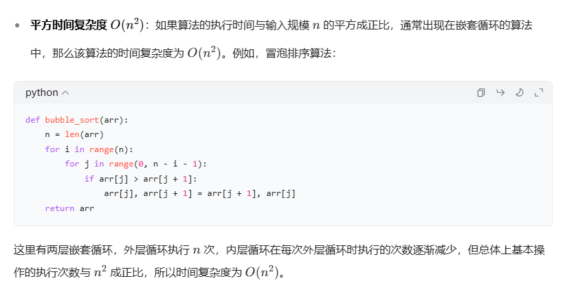
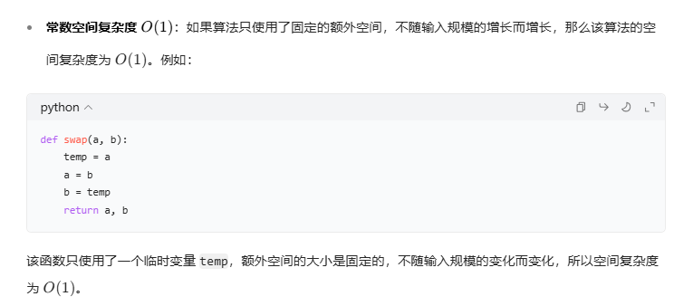
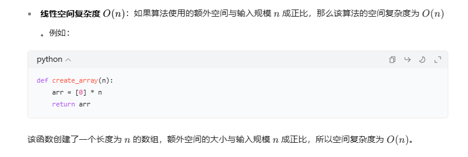
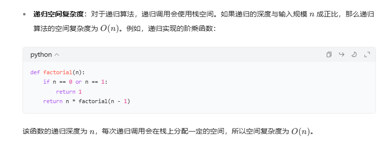
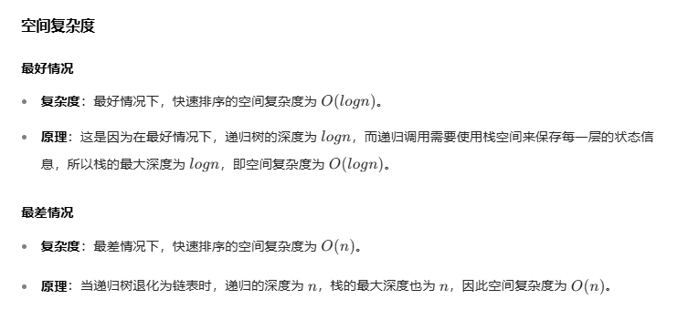

常数时间复杂度 O(1)：如果算法的执行时间不随输入规模的增长而增长，即无论输入规模多大，算法的执行时间都是一个常数，那么该算法的时间复杂度为 O(1)例如：

    def get_first_element(arr):
        return arr[0]
无论数组 arr 的长度是多少，该函数只执行一次返回操作，基本操作的执行次数是固定的，所以时间复杂度为 O(1)。
线性时间复杂度 O(n)：如果算法的执行时间与输入规模n成正比，即基本操作的执行次数随着n的增长而线性增长，那么该算法的时间复杂度为O(n)例如：

    def sum_array(arr):
        total = 0
        for num in arr:
            total += num
        return total

对数时间复杂度 O(logn)

    def binary_search(arr, target):
        left, right = 0, len(arr) - 1
        while left <= right:
            mid = (left + right) // 2
            if arr[mid] == target:
                return mid
            elif arr[mid] < target:
                left = mid + 1
            else:
                right = mid - 1
        return -1

每次循环都将搜索范围缩小一半，所以基本操作的执行次数与 

* 快速排序

